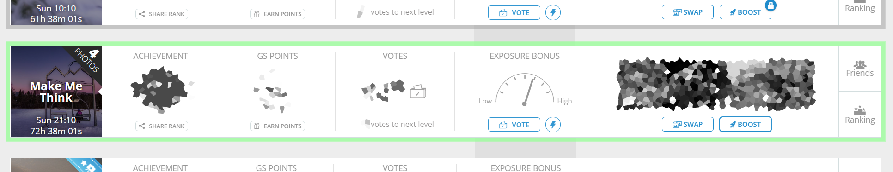

This script might help you notice when the boost is available for challenge.
What this script does, is just find all active Boost buttons and add a green(ish) border around the challenge block

> [!TIP]  
> Old script with comments can be found
> on [this gist](https://gist.github.com/Karmalakas/dd3e9d1744a67dd6fd2272c652bbea66)

---

