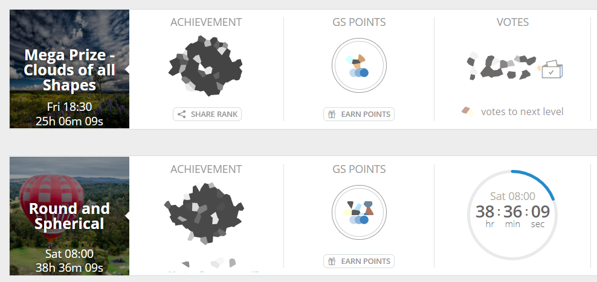
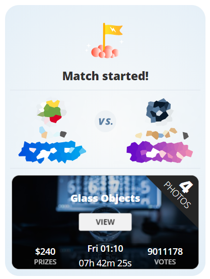
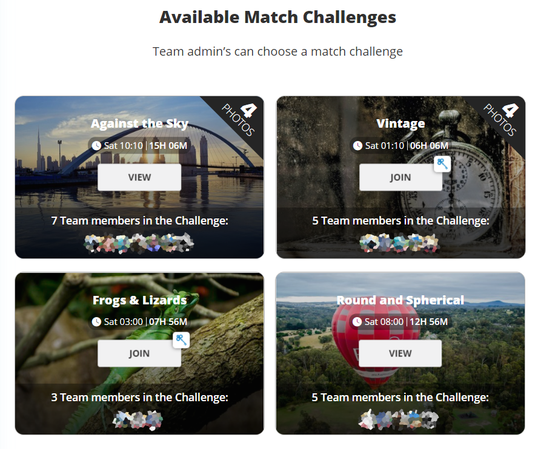
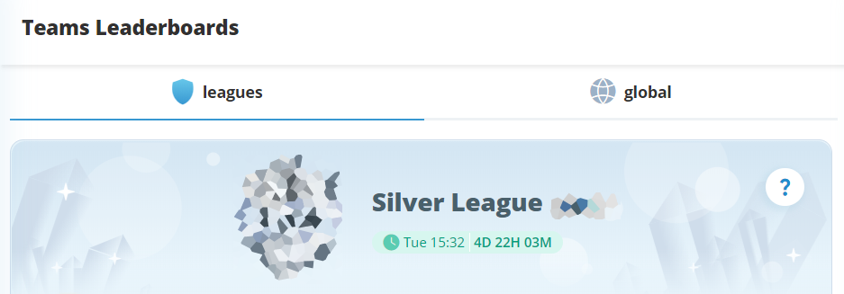
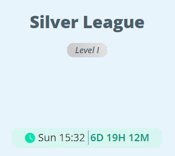
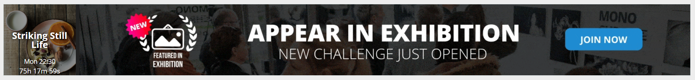
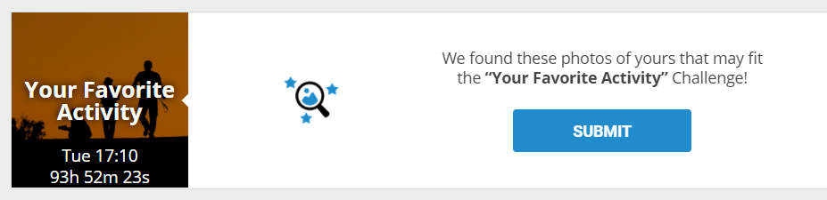
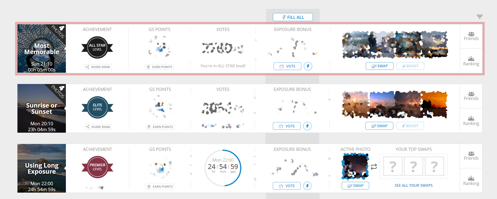

This will definitely help plan your challenges much easier.
Maybe GS will add this feature some day natively both on web and app :)

Basically what this script does, is just find all timers on a page, calculate end time for each timer
based on your operating system time and add an element with that end time.

> [!NOTE]  
> There was one case reported, when AdBlocker on Opera browser prevented script from displaying time
> on the Upcoming challenges page

> [!INFO]  
> Old script with comments can be found
> on [this gist](https://gist.github.com/Karmalakas/25910e649f2feb26e4e8298af938a09e)

---

#### Main current challenges view

#### Open challenges view

#### Upcoming challenges page

#### Challenge details view

  

#### Team chat view

#### Team match view

#### Team match selection

#### League

  

#### Banner

#### Suggestions

#### Red border when less than 10 minutes left

