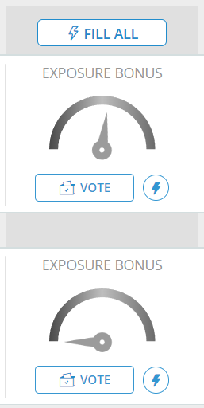
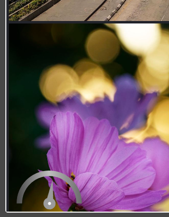

This script will add a grayscale filter to the shiny gauges on Gurushots website. Nothing more, nothing less

> [!INFO]  
> Old script with comments can be found
> on [this gist](https://gist.github.com/Karmalakas/c09c8bcc24cb213b3feadefc944ab8dd)

---

 