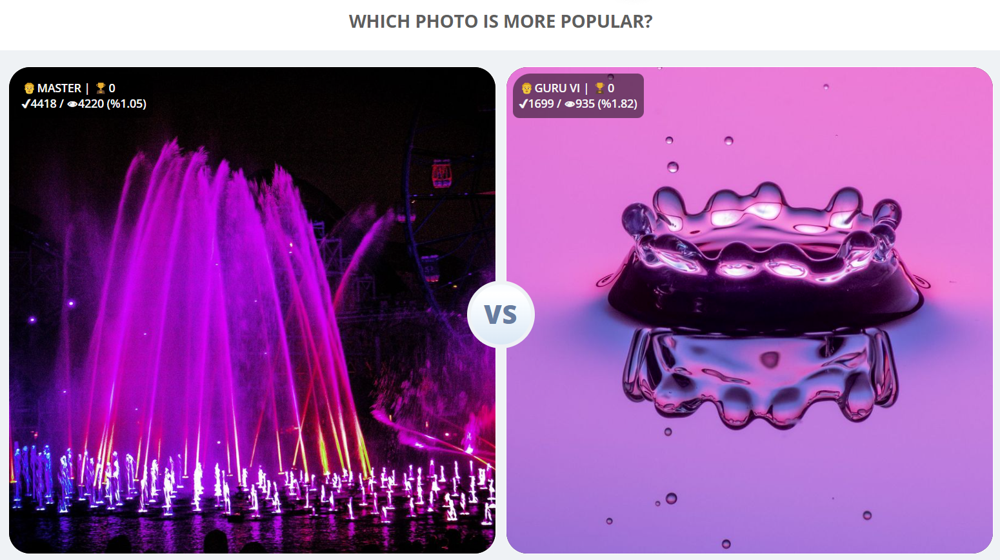

This script shows some info for each photo in the mini-game (aka Turbo challenge)

> [!INFO]  
> Old script with comments can be found
> on [this gist](https://gist.github.com/Karmalakas/1b63e946d3b3a3f393bb2d5d5cf19b1e)

**Info of the image includes:**

- Author level
- All-time achievements (excl. level and percentage; e.g. All Star, Elite, Top Photo 20%, etc.)
- All-time votes
- All-time views
- All-time ratio

You have to wait for a few seconds to load images info when popup is opened

> [!IMPORTANT]  
> **This does not mean, that better photo actually will win the battle for the specific challenge**

---

